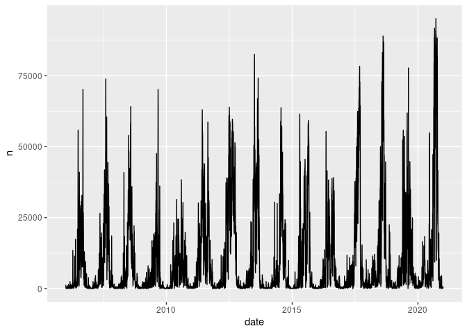
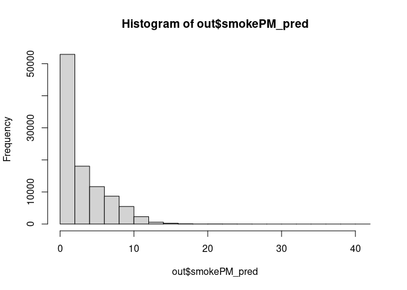

```r
library(tidyverse)
library(magrittr)
library(lubridate)
library(sf)
```


```r
# Load smokePM predictions on smoke days
preds = read_csv("../data/input/smoke_PM/smokePM2pt5_predictions_daily_10km_20060101-20201231.csv") %>% 
  mutate(date = ymd(date))
```

```
## Rows: 51434138 Columns: 3
## ── Column specification ───────────────────────────────────────────────────────
## Delimiter: ","
## dbl (3): grid_id_10km, date, smokePM_pred
## 
## ℹ Use `spec()` to retrieve the full column specification for this data.
## ℹ Specify the column types or set `show_col_types = FALSE` to quiet this message.
```

```r
# Load 10 km grid
grid_10km = read_sf("../data/input/remote_data/10km_grid_wgs84/10km_grid_wgs84.shp")
```


```r
# Identify days with smoke
tibble(smoke_days = unique(preds$date), year = lubridate::year(smoke_days)) %>% 
  group_by(year) %>% 
  summarise(n = n())
```

```
## # A tibble: 15 × 2
##     year     n
##    <dbl> <int>
##  1  2006   358
##  2  2007   357
##  3  2008   356
##  4  2009   361
##  5  2010   361
##  6  2011   365
##  7  2012   366
##  8  2013   357
##  9  2014   354
## 10  2015   354
## 11  2016   360
## 12  2017   365
## 13  2018   364
## 14  2019   365
## 15  2020   366
```

```r
## mostly all days have smoke present
```


```r
# Identify grids with smoke per day
preds %>% 
  group_by(date) %>% 
  summarise(n = n()) %>% 
  ggplot() +
  geom_line(aes(x = date, y = n))
```

<!-- -->

```r
## in most days smoke is present in grids, but the number is significantly different
```


```r
## Print days with more than 50,000 grids with smoke 
preds %>% 
  group_by(date) %>% 
  summarise(n = n()) %>% 
  filter(n > 50000)
```

```
## # A tibble: 203 × 2
##    date           n
##    <date>     <int>
##  1 2006-06-29 55846
##  2 2006-09-06 50299
##  3 2006-09-07 70197
##  4 2007-08-04 73813
##  5 2007-08-05 56158
##  6 2007-08-14 50262
##  7 2007-08-16 52165
##  8 2007-08-18 60469
##  9 2008-07-01 54000
## 10 2008-07-28 50578
## # … with 193 more rows
```


```r
## Get a full-grid representation for a day
date_ = as.Date("2006-06-29")

out = expand.grid(grid_id_10km = grid_10km$ID, date = date_)

# Match smokePM predictions on smoke days to grid cell-days
out = left_join(out, preds, by = c("grid_id_10km", "date"))

sum(is.na(out$smokePM_pred))
```

```
## [1] 44310
```

```r
## grids with no smoke
```


```r
# Predict 0 for remaining grid cell-days with no smoke
out = mutate(out, smokePM_pred = replace_na(smokePM_pred, 0))

hist(out$smokePM_pred)
```

<!-- -->
