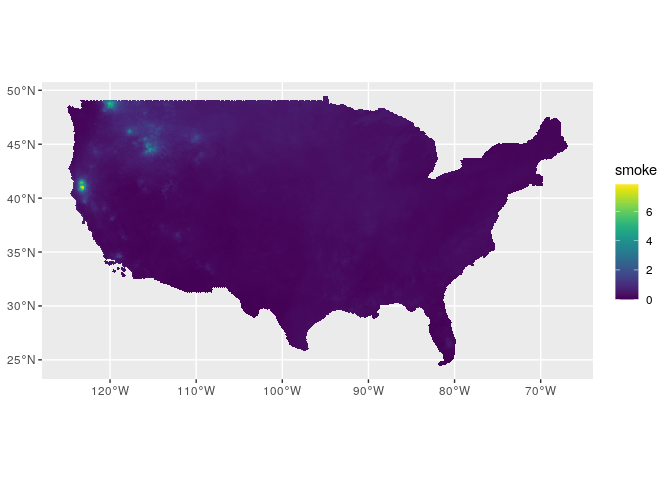
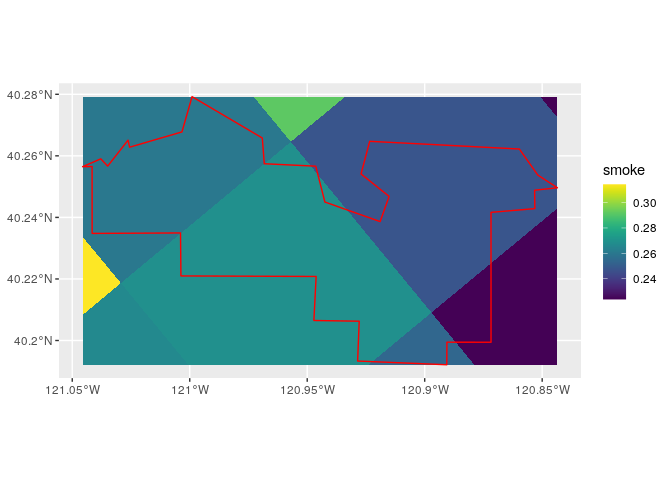
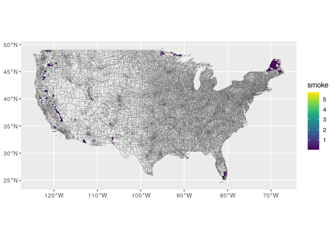

```r
library(tidyverse)
library(magrittr)
library(lubridate)
library(sf)
library(raster)
library(rgeos)
library(viridis)
library(tictoc)
```

## Join smoke values to grid


```r
## Load grid and zip sf objects
grid_sf = read_rds("../data/intermediate/scratch/grid_sf.rds") %>% 
  rename(grid_id = ID)
zip_sf = read_rds("../data/intermediate/scratch/zip_sf.rds") 

# Load smoke grid data frame
smoke_grid_df_list = read_rds("../data/intermediate/scratch/smoke_grid_df_list.rds")

smoke_grid_df = smoke_grid_df_list[["2006"]]
head(smoke_grid_df)
```

```
## # A tibble: 6 x 3
## # Groups:   grid_id [6]
##   grid_id  year  smoke
##     <dbl> <dbl>  <dbl>
## 1    1397  2006 0.0615
## 2    1398  2006 0.0576
## 3    1399  2006 0.0541
## 4    1400  2006 0.0470
## 5    1401  2006 0.0462
## 6    1402  2006 0.0438
```


```r
# Join grid with smoke values
grid_sf %<>% 
  left_join(smoke_grid_df)
```

```
## Joining, by = "grid_id"
```

```r
sum(!grid_sf$grid_id %in% smoke_grid_df$grid_id)
```

```
## [1] 0
```

```r
sum(is.na(grid_sf$smoke))
```

```
## [1] 0
```


```r
grid_sf %>% 
  #st_as_sf() %>% 
  st_simplify() %>% 
  ggplot() + 
  geom_sf(aes(fill = smoke), colour = NA, lwd = 0) + 
  scale_fill_viridis()
```

```
## Warning in st_simplify.sfc(st_geometry(x), preserveTopology, dTolerance): st_simplify does not
## correctly simplify longitude/latitude data, dTolerance needs to be in decimal degrees
```

<!-- -->

## Test `over`


```r
zip_i_sf <- dplyr::select(zip_sf[1, ], c("geometry"))
grid_i_sf <- dplyr::select(st_crop(grid_sf, extent(zip_i_sf)), c("smoke", "geometry"))
```

```
## although coordinates are longitude/latitude, st_intersection assumes that they are planar
```

```
## Warning: attribute variables are assumed to be spatially constant throughout all geometries
```

```r
grid_i_sf %>% 
  ggplot() + 
  geom_sf(aes(fill = smoke), colour = NA, lwd = 0) + 
  scale_fill_viridis() + 
  geom_sf(data = zip_i_sf, linewidth = 1, color = "red", fill = NA)
```

```
## Warning: Ignoring unknown parameters: linewidth
```

<!-- -->


```r
zip_i_sp = as_Spatial(zip_i_sf)
grid_i_sp = as_Spatial(grid_i_sf)

class(zip_i_sp)
```

```
## [1] "SpatialPolygonsDataFrame"
## attr(,"package")
## [1] "sp"
```

```r
class(grid_i_sp)
```

```
## [1] "SpatialPolygonsDataFrame"
## attr(,"package")
## [1] "sp"
```

```r
as.numeric(zip_i_sp %over% grid_i_sp)
```

```
## [1] 0.2535039
```

## Measure time it takes to apply `over` to 100 zips


```r
zip_sf$smoke = 0

## iterating over zip codes ----
tic("apply *over* to 100 zips")
for (i in 1:100) {
  zip_i_sf <- dplyr::select(zip_sf[i, ], c("geometry"))
  grid_i_sf <- try(
    dplyr::select(st_crop(grid_sf, extent(zip_i_sf)), c("smoke", "geometry")),
    silent = T)

  if(class(grid_i_sf)[1] != "try-error"){
    zip_i_sp = as_Spatial(zip_i_sf)
    grid_i_sp = as_Spatial(grid_i_sf)

    zip_sf$smoke[i] <- as.numeric(zip_i_sp %over% grid_i_sp)
  } else zip_sf$smoke[i] <- as.numeric(NA)
}
toc()
```

```
## apply *over* to 100 zips: 44.372 sec elapsed
```


```r
## plot 100 zips ----
zip_sf %>% 
  filter(smoke > 0) %>%  
  st_simplify() %>% 
  ggplot() + 
  geom_sf(data = zip_sf, lwd = 0.1) + 
  geom_sf(aes(fill = smoke), lwd = 0.1) + 
  scale_fill_viridis()
```

```
## Warning in st_simplify.sfc(st_geometry(x), preserveTopology, dTolerance): st_simplify does not
## correctly simplify longitude/latitude data, dTolerance needs to be in decimal degrees
```

<!-- -->

## Test `var_poly_to_poly` function on 10 zips


```r
source("../../lib/var_poly_to_poly.R")

var_poly_to_poly(
  x_poly_sf = grid_sf, 
  y_poly_sf = zip_sf[1:10, ], 
  y_id = "ZIP", 
  x_var = "smoke", 
  fn = mean
)
```

```
## # A tibble: 10 x 2
##    ZIP    smoke
##  * <chr>  <dbl>
##  1 00012 0.251 
##  2 00014 0.0399
##  3 00015 0.0269
##  4 00016 0.110 
##  5 00017 0.160 
##  6 00018 1.15  
##  7 00019 0.220 
##  8 00020 0.125 
##  9 00022 0.326 
## 10 00026 0.228
```
