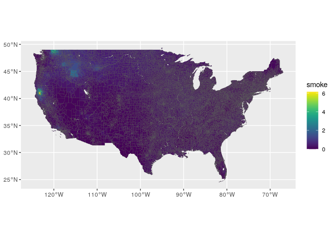

```r
library(tidyverse)
library(magrittr)
library(lubridate)
library(sf)
library(raster)
library(viridis)
```

## Join smoke values to shape


```r
## Load zip sf object
zip_sf = read_rds("../data/intermediate/scratch/zip_sf.rds") 

# Load zip smoke data frame
zip_smoke_df = read_rds("../data/output/zip_smoke_df.rds")

head(zip_smoke_df)
```

```
## # A tibble: 6 x 2
##   ZIP    smoke
##   <chr>  <dbl>
## 1 00012 0.251 
## 2 00014 0.0399
## 3 00015 0.0269
## 4 00016 0.110 
## 5 00017 0.160 
## 6 00018 1.15
```


```r
# Join shapes with smoke values
zip_sf %<>% 
  left_join(zip_smoke_df)
```

```
## Joining, by = "ZIP"
```

```r
sum(!zip_sf$ZIP %in% zip_smoke_df$ZIP)
```

```
## [1] 0
```

```r
sum(is.na(zip_sf$smoke))
```

```
## [1] 0
```


```r
zip_sf %>% 
  #st_as_sf() %>% 
  st_simplify() %>% 
  ggplot() + 
  geom_sf(aes(fill = smoke), lwd = 0.1) + 
  scale_fill_viridis()
```

```
## Warning in st_simplify.sfc(st_geometry(x), preserveTopology, dTolerance): st_simplify does not
## correctly simplify longitude/latitude data, dTolerance needs to be in decimal degrees
```

<!-- -->
